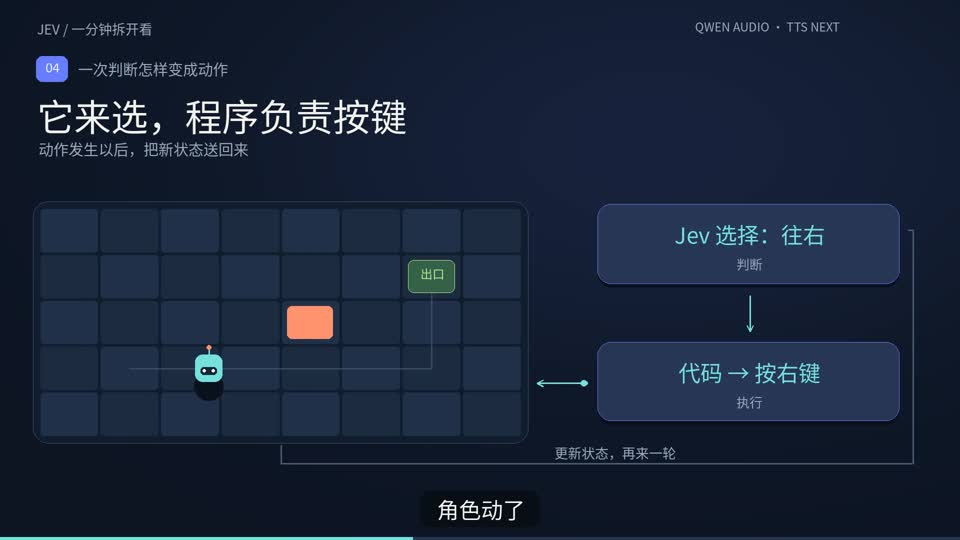
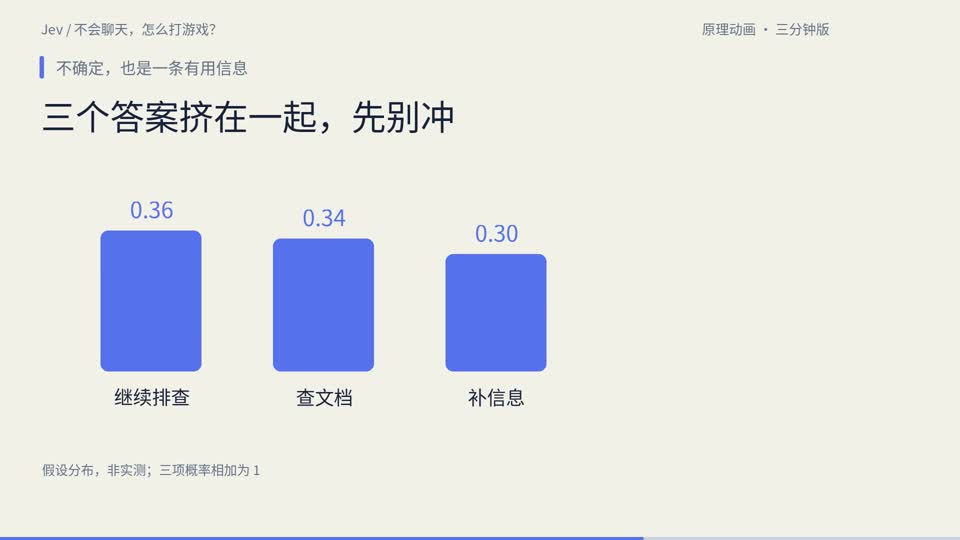

# 中文科普视频工作室

把两次实际制作的 Jev 科普视频整理成一个可复用工程：一分钟版与三分钟版、原始创作提示词、时间轴、渲染代码、中文制作方法，以及给 Agent 使用的 Skill。

## 两个实例

| 实例 | 时长 | 画面风格 | 内容 |
|---|---:|---|---|
| `jev_60s` | 60.48 秒 | 深蓝底 | 状态、判断、执行、Agent 分流、掉坑反例 |
| `jev_3min` | 188.08 秒 | 深蓝与米白交替，保留已确认的设计 | 增加三类判断、上下文分支、置信度与测试办法 |

两个实例均输出 1920×1080、30fps、H.264/AAC；字幕使用实际配音时间轴。游戏为原创教学动画，并非 Jev 实测录像。

## 看成片

### 一分钟版 · 60 秒讲清 Jev

[](media/jev_60s.mp4)

[观看 / 下载视频](media/jev_60s.mp4) · [试听配音](media/jev_60s.mp3) · [中文字幕](examples/jev_60s/subtitles.srt)

### 三分钟版 · 把原理展开

[](media/jev_3min.mp4)

[观看 / 下载视频](media/jev_3min.mp4) · [试听配音](media/jev_3min.mp3) · [中文字幕](examples/jev_3min/subtitles.srt)

点击封面进入视频文件；GitHub 客户端若不提供内嵌播放，可以下载 MP4 观看。

## 具体怎么实现

1. **资料与口播**：核对官方资料，把核心问题写成自然中文，再拆成逐镜分镜。
2. **生成声音**：Qwen-Audio-3.1-TTS-Next 根据脚本和已选定参考音生成配音。一分钟版一次生成；三分钟版采用三段声音，异常段单独重做。
3. **对齐字幕**：默认使用 Qwen Filetrans 获取转写及句级、词级时间戳，再按原稿校对。两个示例制作时使用 faster-whisper 对齐，字幕和动画读取同一份时间轴。
4. **代码画动画**：Python + Pillow 按时间绘制角色移动、选项、状态卡片、概率条和路由图，中文字体随项目提供。
5. **合成与验收**：FFmpeg 编码 H.264/AAC，输出 1080p、30fps；检查字幕、排版、动作顺序、音量和完整解码。

三分钟版还剪掉了较长的句间空白，分段调整响度，没有整体加速人声。游戏画面是原创机制演示，不是 Jev 实测录屏。

## 快速开始

需要 Python 3.10+ 和可从终端执行的 FFmpeg / FFprobe。

```bash
python -m venv .venv
source .venv/bin/activate
python -m pip install -r requirements.txt
```

先生成截图，无需 API Key 或音频：

```bash
python scripts/render.py jev_60s --still 26
python scripts/render.py jev_3min --still 149.9
```

输出在 `outputs/实例名/`。仓库包含两版成片、便于试听的 MP3 音轨、封面和字体；私人参考人声不提交。

### 复现已交付的视频

直接从仓库里的视频提取音轨，再渲染：

```bash
python scripts/prepare_demo_audio.py
python scripts/render.py jev_60s
python scripts/render.py jev_3min
```

MP3 用于试听；默认复现从 MP4 中的音轨转成工作 WAV，不需要 API Key。若需使用最初未压缩的音频，可从此前交付的完整工程导入：

```bash
python scripts/import_audio.py jev_60s /你的路径/jev_source.zip
python scripts/import_audio.py jev_3min /你的路径/jev_3min_source.zip
```

也可用 `--audio /路径/master.wav` 指定本地音轨。

快速检查一小段：

```bash
python scripts/render.py jev_3min --start 143 --duration 8 --width 960
```

没有音轨时脚本会明确报错，不会偷偷调用 TTS。起点和时长控制片段范围，width 控制输出宽度，均不改变口播速度。

## 使用 Next 生成新配音

在当前终端设置环境变量；不要把真实值写进代码、文档或 Git 提交：

```bash
export DASHSCOPE_API_KEY='在本机填入你的密钥'
export SFM_WORKSPACE_ID='在本机填入你的业务空间ID'
```

`.env.example` 只说明变量，脚本不自动加载 `.env`。旧变量 `WORKSPACE_ID` 也支持，优先用 `SFM_WORKSPACE_ID`。

把参考音放到 `local_media/reference.wav`，再调用：

```bash
python scripts/tts_next.py \
  --prompt examples/jev_60s/prompts/narration.txt \
  --reference local_media/reference.wav \
  --run my_voice_01
```

这是会调用在线生成接口的命令。每次新的 `--run` 只提交一次生成请求，不自动重试。若生成已成功、下载失败，使用相同运行名和 `--resume` 只继续下载，不重复生成。原始响应可能包含临时地址，只存在被忽略的 `runs/` 目录。

### Qwen Filetrans 转写与字幕定位

默认使用已实测成功的 `qwen-audio-3.1-asr-flash-filetrans`，读取同一个 `DASHSCOPE_API_KEY`，无需安装 Whisper：

```bash
python scripts/asr_qwen.py \
  --response-file runs/my_voice_01/response_private.json \
  --run-dir runs/asr_01
```

也可用 `--audio-url` 指定服务端可访问的音频地址。本地路径不直接上传；Next 原始下载地址可从缓存响应读取，需在有效期内使用。

脚本提交一次异步任务，保存 task_id 后查询结果；默认等待最多 300 秒。网络或下载失败、等待超时后续跑：

```bash
python scripts/asr_qwen.py --run-dir runs/asr_01 --resume
```

输出包括 `alignment.json`（句、词起止时间，单位秒）、`transcript.txt` 和 `subtitles.draft.srt`。SRT 是按识别句子导出的草稿，需要按原稿修正专名、断句和长行，再用于画面。不能直接把 alignment.json 当成实例的动画 timeline.json。

**实测：60.48 秒配音返回 13 个句子、131 个词条，均有时间戳。** 本次只传 `channel_id: [0]`，没有添加 `enable_words`。`Jev` 等专名仍有误识别，使用前需校对。完整参数、恢复方式和实测记录见 [Qwen ASR 接入](docs/Qwen-ASR接入.md)。

如需离线处理本地文件，可选用 Whisper：

```bash
python -m pip install -r requirements-alignment.txt
python scripts/align_whisper.py runs/my_voice_01/master.wav --output runs/my_voice_01/alignment.json
```

Whisper 首次会下载本地模型；旧入口 `align_audio.py` 保留兼容。新配音或剪辑后的音轨应重新定位，不能直接套用旧字幕时间。

## 项目结构

```text
examples/       两个视频的画面、口播、提示词、字幕、时间轴与事实依据
scripts/        共用的生成、导入、转写、渲染和提交检查入口
skills/         Agent 可读取的科普视频制作 Skill
assets/fonts/   中文字体与原许可证
media/          经确认的两版视频、试听音轨与封面
docs/          中文流程、复盘和验收说明
local_media/    本地音轨与参考音，不提交
runs/           API 运行数据，不提交
outputs/        截图与成片，不提交
```

## 给 Agent 使用

读 `skills/science-video-production/SKILL.md`，按该 Skill 处理主题。它沉淀制作方法与失败经验，不固定新主题必须使用 Jev 的格子游戏，也不要求把每期都做成卡片。

仓库中包含 Skill 文件，不代表已自动安装到 ChatGPT 的个人 Skill 列表。

- [制作流程](docs/制作流程.md)
- [这两次制作的复盘](docs/制作复盘.md)
- [验收办法](docs/验收办法.md)
- [开发与复现](docs/开发与复现.md)

## 提交前检查

```bash
git config core.hooksPath .githooks
git add .
python scripts/check_repo.py
python -m unittest discover -s tests
```

`.gitignore` 排除密钥配置、私人参考音、运行缓存与原始响应；仅放行 `media/` 中明确批准的四个音视频文件；检查脚本读取暂存内容，而不是只看工作目录。规则检查不是完整的秘密识别系统，推送前仍应查看 `git diff --cached --stat` 和具体变更。不要使用 `git add -f` 加回这些文件。

代码尚未指定开源许可证；字体按 `assets/fonts/LICENSE.txt` 的许可分发。是否公开仓库、是否另加代码许可证，由仓库所有者决定。
